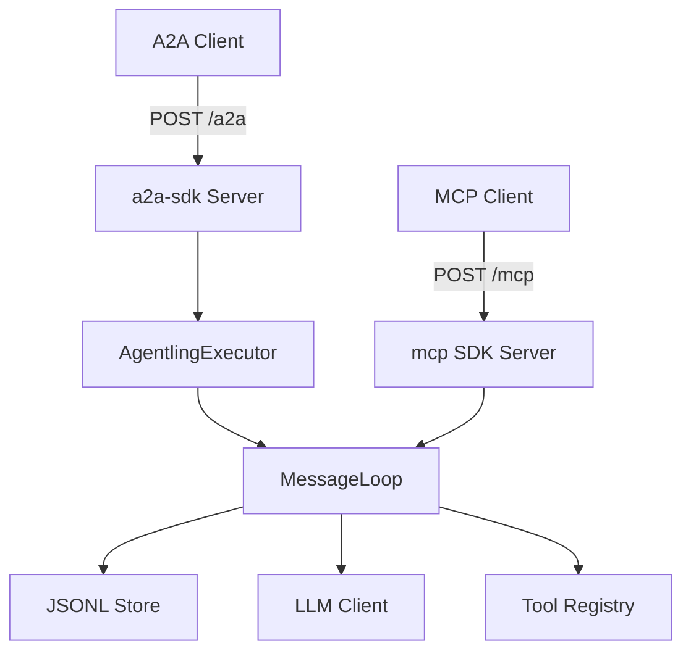

<p align="center">
  
</p>

<h1 align="center">Agentlings</h1>

<p align="center">
  Lightweight single-process agent framework exposing both
  <a href="https://a2a-protocol.org">A2A</a> and
  <a href="https://modelcontextprotocol.io">MCP</a> on a single HTTP port.
</p>

---

Each agentling is a small, focused AI agent whose identity is defined by configuration — name, description, system prompt, and tools — not code. The framework handles protocol compliance, conversation journaling, and context management. The LLM is the agent; the framework records and replays.

## Quick start

```bash
pip install -e ".[dev]"

# Run with mock LLM (no API key needed)
AGENT_LLM_BACKEND=mock AGENT_API_KEY=dev agentling

# Run with Anthropic
ANTHROPIC_API_KEY=sk-ant-... AGENT_API_KEY=your-key agentling
```

The agent serves:
- `GET /.well-known/agent-card.json` — A2A Agent Card (public, no auth)
- `POST /a2a` — A2A JSON-RPC endpoint
- `POST /mcp` — MCP Streamable HTTP endpoint

## Docker

```bash
docker build -t agentling:latest .
docker run -e AGENT_API_KEY=your-key -e AGENT_LLM_BACKEND=mock -p 8420:8420 agentling
```

## Configuration

All via environment variables (or `.env` file):

| Variable | Default | Description |
|----------|---------|-------------|
| `ANTHROPIC_API_KEY` | — | Anthropic API key (required for real LLM) |
| `AGENT_API_KEY` | — | API key for authenticating clients |
| `AGENT_MODEL` | `claude-sonnet-4-6` | Anthropic model ID |
| `AGENT_MAX_TOKENS` | `4096` | Max tokens per LLM response |
| `AGENT_HOST` | `0.0.0.0` | Bind address |
| `AGENT_PORT` | `8420` | Bind port |
| `AGENT_DATA_DIR` | `./data` | JSONL journal storage directory |
| `AGENT_NAME` | `agentling` | Agent identity (used in Agent Card + MCP tool) |
| `AGENT_DESCRIPTION` | `A lightweight AI agent` | Agent description |
| `AGENT_SYSTEM_PROMPT_FILE` | — | Path to custom system prompt (overrides default) |
| `AGENT_LOG_LEVEL` | `INFO` | Log level |
| `AGENT_LLM_BACKEND` | `anthropic` | `anthropic` or `mock` |

## Architecture



Both protocols feed into a single `MessageLoop.process_message()` entrance. Conversations are persisted as append-only JSONL journals with compaction markers as replay cursors.

## Testing

```bash
# Unit tests (no network, no LLM)
pytest tests/unit/ -v

# Integration tests (starts real server with mock LLM)
pytest tests/integration/ -v

# All tests
pytest tests/ -v
```

Integration tests use native SDK clients — `a2a-sdk` `ClientFactory` for A2A and `mcp` `ClientSession` for MCP — talking to a real server over HTTP. All LLM responses are mocked.

## Built with

- [a2a-sdk](https://github.com/a2aproject/a2a-python) — A2A protocol server + client
- [mcp](https://github.com/modelcontextprotocol/python-sdk) — MCP protocol server + client
- [anthropic](https://github.com/anthropics/anthropic-sdk-python) — LLM backend
- [starlette](https://www.starlette.io) + [uvicorn](https://www.uvicorn.org) — HTTP server
