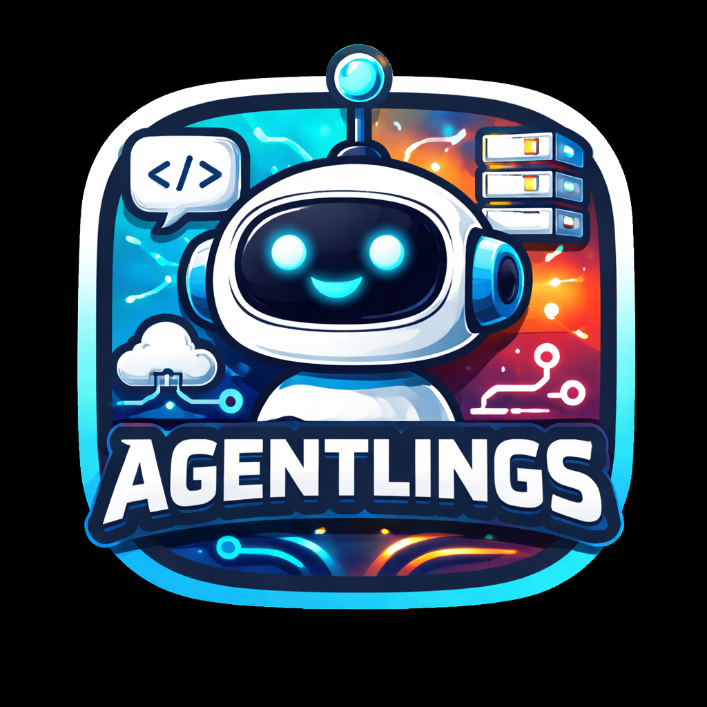
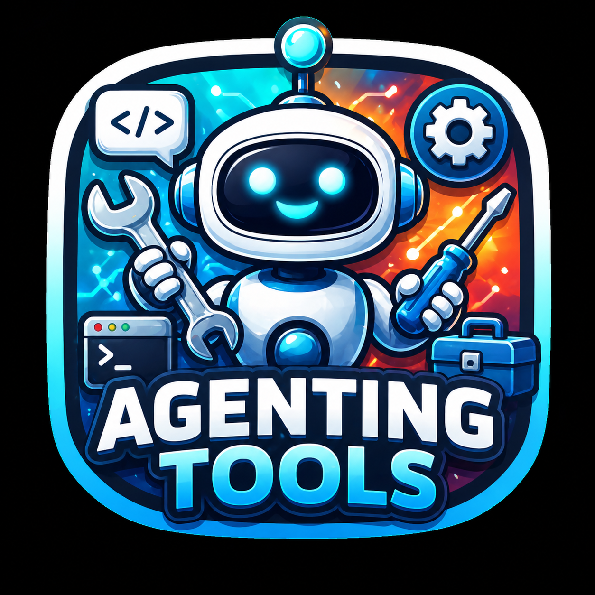
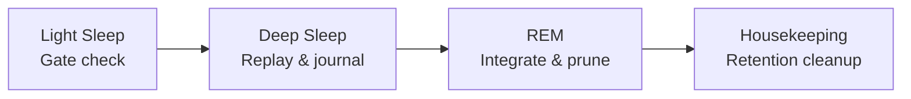
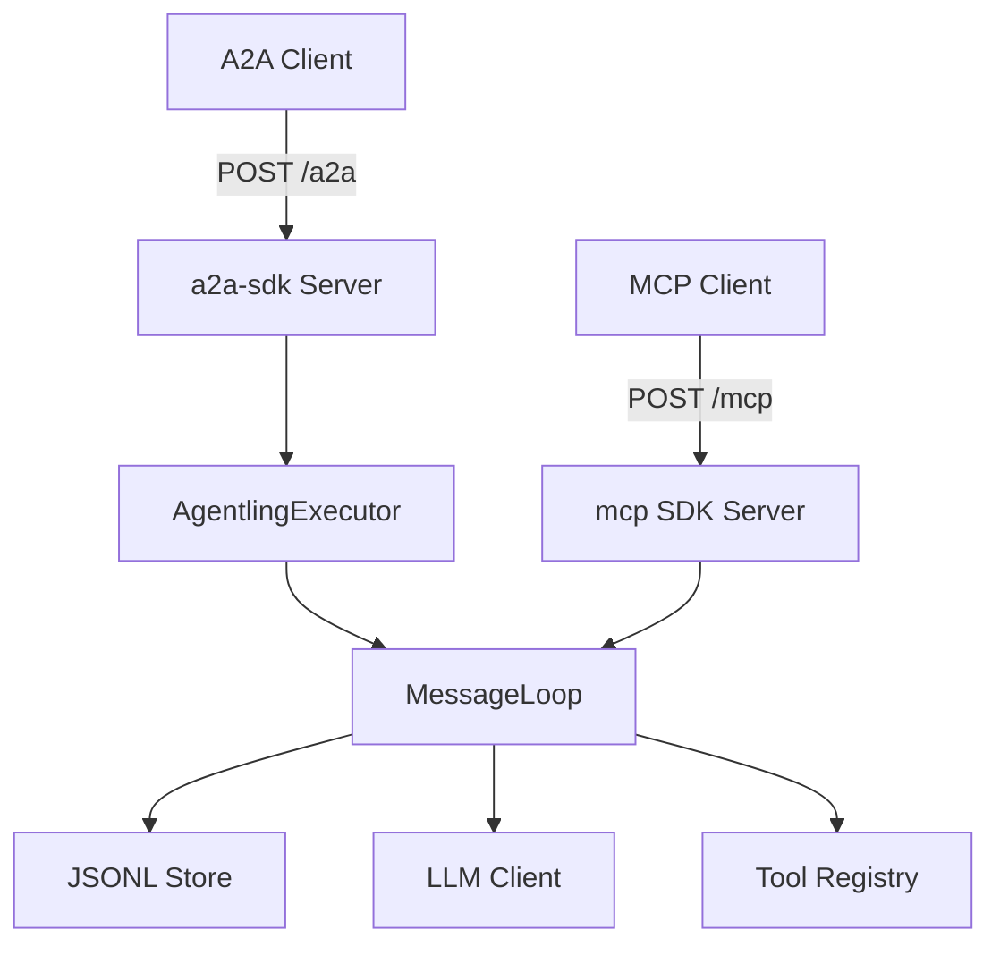

<p align="center">
  
</p>

<h1 align="center">Agentlings</h1>

<p align="center">
  Lightweight single-process agent framework exposing both
  <a href="https://a2a-protocol.org">A2A</a> and
  <a href="https://modelcontextprotocol.io">MCP</a> on a single HTTP port.
</p>

---

Each agentling is a small, focused AI agent whose identity is defined by a YAML config file — name, description, system prompt, tools, and skills. The framework handles protocol compliance, conversation journaling, and context management. The LLM is the agent; the framework records and replays.

## Install

```bash
pip install agentlings
# or, isolated in a managed venv:
uv tool install agentlings
```

## Quick start

```bash
# Scaffold a new agent in ./my-agent/
agentling init my-agent
cd my-agent

# Add your Anthropic key (or leave blank to point at Ollama via ANTHROPIC_BASE_URL)
$EDITOR .env

# Run from the agent dir
agentling run
```

`agentling init` produces a self-contained directory:

```
my-agent/
├── agent.yaml           # identity, system prompt, tools, sleep config
├── .env                 # AGENT_API_KEY auto-generated; ANTHROPIC_API_KEY blank for you
├── .env.example         # checked into source control as a template
├── .framework-version   # the framework version that scaffolded this dir
├── data/                # journals, memory, conversations
│   └── .migrations      # applied-migrations log
├── skills/              # drop SKILL.md bundles here; uncomment AGENT_SKILLS_DIR to enable
└── tools/               # drop @tool-decorated .py files here; uncomment AGENT_TOOLS_DIR to enable
```

`agentling run` reads `agent.yaml`, `.env`, and `data/` from the current directory. To operate on a different dir without `cd`-ing in: `agentling run --dir /path/to/agent`.

Bumping the framework version preserves your data — `pip install --upgrade agentlings && agentling upgrade` runs any pending data migrations against `data/` without touching `agent.yaml` or `.env`.

The running agent serves:
- `GET /.well-known/agent-card.json` — A2A Agent Card (public, no auth)
- `POST /a2a` — A2A JSON-RPC endpoint
- `POST /mcp` — MCP Streamable HTTP endpoint

Both protocols are task-aware. Each request becomes a task; the HTTP handler awaits up to `AGENT_TASK_AWAIT_SECONDS` (default 60) and either returns the final answer inline or yields a task handle the caller polls. A2A clients can opt out of the wait per-request via `configuration.return_immediately = true` on `message/send` (A2A v1.0 JSON name `returnImmediately`) — the handler then enqueues a `Task` object immediately and the caller polls via `tasks/get`.

## CLI

| Command | Purpose |
|---|---|
| `agentling init <name>` | Scaffold a new agent directory from a bundled template |
| `agentling run [--dir]` | Run the agent server from CWD or the given directory |
| `agentling upgrade [--dir]` | Apply pending data migrations after upgrading the framework |
| `agentling memory show` | Print the long-term memory store for the agent in CWD |
| `agentling sleep [--date]` | Run a one-off sleep cycle |
| `agentling list-tools` | List available tools and groups |

## Running as a daemon

The framework deliberately stays out of service-management — `agentling run` is just a long-running foreground process that reads `agent.yaml`, `.env`, and `data/` from its working directory. Wire it into whatever supervisor you already use.

### systemd (Linux)

Set up the agent dir once:

```bash
sudo useradd -r -s /bin/false agentling
sudo mkdir -p /opt/agentling && sudo chown agentling: /opt/agentling
sudo -u agentling python3 -m venv /opt/agentling/venv
sudo -u agentling /opt/agentling/venv/bin/pip install agentlings
sudo -u agentling /opt/agentling/venv/bin/agentling init . --dir /opt/agentling --force
sudo $EDITOR /opt/agentling/.env   # add ANTHROPIC_API_KEY
```

Create `/etc/systemd/system/agentling.service`:

```ini
[Unit]
Description=Agentling
After=network.target

[Service]
Type=simple
User=agentling
WorkingDirectory=/opt/agentling
ExecStart=/opt/agentling/venv/bin/agentling run
Restart=on-failure
RestartSec=5

[Install]
WantedBy=multi-user.target
```

```bash
sudo systemctl daemon-reload
sudo systemctl enable --now agentling
sudo journalctl -u agentling -f
```

To upgrade: `sudo -u agentling /opt/agentling/venv/bin/pip install --upgrade agentlings && sudo -u agentling /opt/agentling/venv/bin/agentling upgrade --dir /opt/agentling && sudo systemctl restart agentling`.

### launchd (macOS)

Set up the agent dir once with `agentling init ~/.agentlings/my-agent`, then create `~/Library/LaunchAgents/com.donkeywork.agentling.plist`:

```xml
<?xml version="1.0" encoding="UTF-8"?>
<!DOCTYPE plist PUBLIC "-//Apple//DTD PLIST 1.0//EN" "http://www.apple.com/DTDs/PropertyList-1.0.dtd">
<plist version="1.0">
<dict>
    <key>Label</key>
    <string>com.donkeywork.agentling</string>
    <key>ProgramArguments</key>
    <array>
        <string>/path/to/venv/bin/agentling</string>
        <string>run</string>
    </array>
    <key>WorkingDirectory</key>
    <string>/Users/you/.agentlings/my-agent</string>
    <key>KeepAlive</key>
    <true/>
    <key>StandardErrorPath</key>
    <string>/tmp/agentling.err</string>
</dict>
</plist>
```

```bash
launchctl load ~/Library/LaunchAgents/com.donkeywork.agentling.plist
tail -f /tmp/agentling.err
```

## Agent definition

Agent identity lives in a YAML file (`agent.yaml`):

```yaml
name: k3s-agentling
description: A k3s cluster management agent

tools:
  - bash
  - filesystem

skills:
  - id: k8s-ops
    name: Kubernetes Operations
    description: Manage cluster resources, diagnose issues, apply manifests
    tags: [kubernetes, k3s, devops]
  - id: file-management
    name: File Management
    description: Read, write, and search configuration files
    tags: [files, yaml]

system_prompt: |
  You are a DevOps engineer managing a k3s Kubernetes cluster.

  All configuration changes go through /mnt/lab/k3s as the source of truth.
  Never use kubectl patch/edit/set directly — write manifests and apply them.

  Before any destructive operation, describe the impact and ask for confirmation.
```

Point to it with `AGENT_CONFIG=./agent.yaml`.

### Available tools

| Group | Tools | Description |
|-------|-------|-------------|
| `bash` | `bash` | Shell command execution with timeout |
| `filesystem` | `read_file`, `write_file`, `edit_file`, `list_directory`, `search_files` | File operations with offset/limit, find-and-replace, glob search |
| `memory` | `memory_edit` | Read and write the agent's persistent long-term memory |

Tools are off by default. Run `agentling list-tools` for details.

## Custom tools

<p align="center">
  
</p>

Beyond the built-ins, you can author your own tools as plain typed Python functions. Decorate them with `@tool`, drop the file in a directory, and point `AGENT_TOOLS_DIR` at it — the agentling scans the directory at startup and registers every `Tool` it finds.

```python
# tools/weather.py
import os
from typing import Annotated, Literal
from pydantic import Field
from agentlings.tools import tool


@tool
async def weather(
    city: Annotated[str, Field(description="City name, e.g. 'Dublin'.")],
    units: Literal["metric", "imperial"] = "metric",
) -> str:
    """Look up current weather for a city."""
    api_key = os.environ["WEATHER_API_KEY"]
    # ...fetch and return a string the LLM can read...
```

Then run with `AGENT_TOOLS_DIR=./tools agentling run`. No registration step, no schema dict — the JSON Schema the LLM sees is derived from the function signature via Pydantic.

### How discovery works

- The loader scans the top level of `AGENT_TOOLS_DIR` for `.py` files (no recursion).
- Files whose name begins with `_` are skipped (use them for shared helpers).
- Each file is imported in isolation — the directory is never added to `sys.path`, so a file named `json.py` cannot shadow the stdlib.
- Every module-level `Tool` instance (i.e. anything you decorated with `@tool`) is registered.
- An import or registration failure on one file is logged and the scan continues — one broken tool cannot brick the agent.

### Authoring contract

| Concept | How to express it |
|---|---|
| Tool name | `func.__name__` (or `@tool(name="...")`) |
| Tool description | The function's docstring (or `@tool(description="...")`) |
| Parameter description / constraints | `Annotated[T, Field(description="...", ge=..., le=...)]` |
| Allowed values | `Literal["a", "b"]` or a `str`/`int` `Enum` |
| Optional / defaults | A normal Python default (`x: int = 30`) |
| Async I/O | `async def` — sync functions are fine too; both are awaited uniformly |
| Per-tool secrets | Read your own env vars inside the function (the framework stays out of secret plumbing) |

Untyped parameters, `*args`, `**kwargs`, and positional-only parameters are rejected at decoration time — `@tool` raises `ToolDefinitionError` so misuse fails loudly at startup, not in production.

Reference tools showcasing each pattern live in `agentlings.tools.examples` (`echo`, `http_get`, `set_severity`, `geocode`).

## Skills

<p align="center">
  
</p>

Skills are bundled instructions the agent activates on demand. Each skill is a directory containing a `SKILL.md` whose YAML frontmatter (`name`, `description`) is loaded into the system prompt at startup; the body — and any sibling `scripts/`, `references/`, or `assets/` — stays on disk until the agent decides the task needs it. This is the **progressive disclosure** model from the [Open Skills specification](https://agentskills.io/specification): metadata is cheap, instructions are loaded on activation, resources are loaded on demand.

```
skills/
├── pdf-processing/
│   ├── SKILL.md
│   ├── scripts/extract.py
│   └── references/FORMS.md
└── data-analysis/
    └── SKILL.md
```

A minimal `SKILL.md`:

```markdown
---
name: pdf-processing
description: Extract text and tables from PDFs, fill PDF forms, merge files. Use when the user mentions PDFs, forms, or document extraction.
---

Step-by-step instructions for the agent go below the frontmatter.
Reference companion files with relative paths, e.g. `scripts/extract.py`.
```

Skills are opt-in: set `AGENT_SKILLS_DIR=./skills` (or any path) and drop skill directories there. On startup the agentling discovers them and prepends a single block to the system prompt explaining progressive disclosure and listing each skill's name, absolute path, and description. The agent reads `SKILL.md` itself when a task calls for the skill.

### Frontmatter constraints

Per the Open Skills spec:

| Field | Required | Constraint |
|---|---|---|
| `name` | Yes | 1–64 chars, lowercase `a-z`, digits, hyphens; no leading/trailing/consecutive hyphens; must match the parent directory name |
| `description` | Yes | 1–1024 chars, non-empty |

Optional fields (`license`, `compatibility`, `metadata`, `allowed-tools`) are accepted but currently ignored at the runtime layer. Malformed skills (missing fields, invalid names, broken YAML) are logged at `WARNING` and skipped — one bad skill does not prevent the agent from booting.

Discovery is strictly read-only — the agentling never writes to, deletes from, or modifies anything under `AGENT_SKILLS_DIR`. `AGENT_SKILLS_DIR` and `AGENT_TOOLS_DIR` share the same opt-in semantics: unset means "don't scan." `AGENT_TOOLS_DIR` additionally never adds the user-tools directory to `sys.path`, so a file named `json.py` cannot shadow the stdlib.

> **Naming note:** the `skills:` array in `agent.yaml` is unrelated — those are A2A Agent Card capabilities advertised on the wire. Runtime skills (this section) live on disk under `AGENT_SKILLS_DIR`.

## Docker

The simplest containerised setup uses the same `init` + `run` flow:

```dockerfile
FROM python:3.12-slim
WORKDIR /agent
RUN pip install agentlings
RUN agentling init . --api-key dev
VOLUME ["/agent/data"]
EXPOSE 8420
CMD ["agentling", "run"]
```

```bash
docker build -t agentling:latest .
docker run -e ANTHROPIC_API_KEY=sk-ant-... -p 8420:8420 -v ./data:/agent/data agentling:latest
```

For production, mount your own `agent.yaml` and `.env` over the scaffolded ones (or skip the `agentling init` build step entirely and bind-mount a host directory with everything pre-populated).

## Environment variables

Secrets and runtime settings stay in env vars or, more commonly, the `.env` file inside the agent directory. `agentling init` creates an `.env` with `AGENT_API_KEY` already populated; everything else is opt-in.

| Variable | Default | Description |
|----------|---------|-------------|
| `AGENT_CONFIG` | `./agent.yaml` (when present) | Path to agent YAML definition |
| `ANTHROPIC_API_KEY` | — | Anthropic API key (required for api.anthropic.com; optional with `ANTHROPIC_BASE_URL` pointed at e.g. Ollama) |
| `ANTHROPIC_BASE_URL` | — | Override the Messages endpoint. Use `http://localhost:11434` to target Ollama's Anthropic-compatible API |
| `AGENT_API_KEY` | — | API key for authenticating clients |
| `AGENT_MODEL` | `claude-sonnet-4-6` | Model ID — set to an Ollama model (e.g. `qwen3-coder`) when using `ANTHROPIC_BASE_URL` |
| `AGENT_MAX_TOKENS` | `4096` | Max tokens per LLM response |
| `AGENT_HOST` | `0.0.0.0` | Bind address |
| `AGENT_PORT` | `8420` | Bind port |
| `AGENT_DATA_DIR` | `./data` | JSONL journal storage directory |
| `AGENT_TOOLS_DIR` | — | Directory of `@tool`-decorated `.py` files to load at startup |
| `AGENT_SKILLS_DIR` | — | Directory of Open Skills `SKILL.md` bundles to advertise to the agent |
| `AGENT_TASK_AWAIT_SECONDS` | `60` | How long the HTTP handler blocks for task completion before returning a working task handle |
| `AGENT_LOG_LEVEL` | `INFO` | Log level |
| `AGENT_LLM_BACKEND` | `anthropic` | `anthropic` or `mock` |
| `AGENT_EXTERNAL_URL` | — | Public URL for Agent Card (needed in Docker/k8s) |
| `AGENT_OTEL_ENDPOINT` | — | OpenTelemetry collector endpoint |
| `AGENT_OTEL_PROTOCOL` | `http` | Collector protocol (`http` or `grpc`) |
| `AGENT_OTEL_INSECURE` | `true` | Disable TLS for collector connection |
| `AGENT_OTEL_HEADERS` | — | Comma-separated `key=value` pairs for collector auth |
| `AGENT_OAUTH_ISSUER` | — | OAuth/OIDC issuer URL; setting it enables bearer-token validation |
| `AGENT_OAUTH_AUDIENCE` | — | Resource identifier validated against the token's `aud` claim |
| `AGENT_OAUTH_JWKS_URI` | — | JWKS endpoint; derived from the issuer's OIDC discovery doc when unset |

## OAuth

Beyond the shared `AGENT_API_KEY`, an agentling can accept **OAuth 2.0 bearer tokens** issued by an external identity provider (Keycloak, Auth0, Entra, …). It acts purely as a *resource server*: it validates a token's signature against the issuer's published JWKS and checks `iss`/`aud`/`exp`. It never issues tokens, inspects user identity, or enforces scopes — any validly-signed, correctly-audienced, unexpired token from the trusted issuer is accepted.

Enable it with an `oauth` block in `agent.yaml` (or the `AGENT_OAUTH_*` env vars above):

```yaml
oauth:
  enabled: true
  issuer: https://auth.example.com/realms/Agents
  audience: my-agentling-api          # must match the token's aud claim
  jwks_uri: null                      # optional; derived from OIDC discovery when omitted
```

Both protocol surfaces are covered by a single auth layer — the API key and a bearer token are *both* accepted (either credential passes), so existing API-key clients keep working while OAuth clients use tokens. Each protocol advertises the requirement in its own dialect:

- **MCP** serves RFC 9728 Protected Resource Metadata at `/.well-known/oauth-protected-resource` (and the path-suffixed `/mcp` variant) and returns `401` with a `WWW-Authenticate` challenge pointing at it.
- **A2A** declares an `openIdConnect` security scheme in the Agent Card, pointing clients at the issuer's `/.well-known/openid-configuration`.

Both documents are generated from the single `oauth` block, so they can never drift from what the server actually validates. The provider hosts all authorization-server metadata; the agentling only names the issuer.

> **Audience binding is the security boundary.** Configure your IdP to issue tokens whose `aud` contains the value in `audience` (e.g. a Keycloak *Audience* protocol mapper or client scope). A token minted for a different resource will be rejected — which is exactly what stops a token issued for one agentling being replayed against another.

## Icons

An agentling can advertise **icons** on its MCP surface so clients can show a recognizable image for the server and its tools. Icons ride on the standard MCP `Icon` type — the server's on `serverInfo.icons`, and one per tool (the spawn tool named after the agent, and its `__get_task` companion).

Configure with an `icons` block in `agent.yaml`:

```yaml
icons:
  server: https://cdn.example.com/icons/agentling.png   # MCP serverInfo icon
  spawn:  https://cdn.example.com/icons/play.png         # the main (spawn) tool
  task:   https://cdn.example.com/icons/task.png         # the __get_task tool
```

Each value is the **full icon URL** — an HTTPS address or a `data:` URI — served as a single icon that the client scales to fit. The MIME type is inferred from the extension (`.png`, `.jpg`/`.jpeg`, `.svg`, `.webp`); `data:` URIs carry their own. PNG and JPEG are universally supported by clients; SVG and WebP are not guaranteed. Omit a key — or the whole block — to send no icon for that surface.

> We advertise **one icon per surface**, not a multi-resolution set. The spec's `icons` array is meant for clients to pick a best-fit size, but real clients (the MCP Inspector among them) render *every* entry side by side — so a single icon is the only thing that displays cleanly today.

## Memory

Agentlings can maintain persistent long-term memory — a curated set of key-value facts that survive across conversations. Memory transforms an agent from a tool that forgets into one that learns.

### How it works

Memory is a JSON file (`data/memory/memory.json`) containing entries like:

```json
{
  "entries": [
    {
      "key": "cluster-node-count",
      "value": "4 nodes: node1 (control), node2-4 (workers)",
      "recorded": "2026-04-01T10:00:00Z"
    }
  ]
}
```

The memory block is injected into the system prompt on every LLM call, between the agent's identity and the conversation history. The agent sees its accumulated knowledge as working context, not as a separate tool call.

### The memory tool

When the `memory` tool group is enabled, the agent gets a `memory_edit` tool with three operations:

| Operation | Description |
|-----------|-------------|
| `set` | Upsert an entry by key. Updates the timestamp. |
| `remove` | Delete an entry by key. |
| `list` | Return all current entries. |

The agent decides what to remember based on its system prompt. A DevOps agent might store cluster topology and known issues. A support agent might store escalation paths and recurring problems.

### CLI

```bash
# Show current memory
agentling memory show
```

### Configuration

```yaml
memory:
  token_budget: 2000        # max tokens for the memory block in the system prompt
  # injection_prompt: null   # override the memory/data-dir-awareness template
```

## Sleep cycle

<p align="center">
  
</p>

The sleep cycle is a nightly process that journals the day's activity, consolidates new knowledge into memory, prunes stale entries, and cleans up old files. It maps to biological sleep phases.



### Phase 1: Light sleep — gate check

Quick check: were there any conversations today? If not, skip everything. No LLM calls, no cost.

### Phase 2: Deep sleep — replay and file

For each conversation from today, the sleep cycle reads the JSONL journal from the last compaction marker and submits all summaries as a single **batch request** to the Anthropic Message Batches API. Batch processing runs at 50% cost and processes in parallel.

Each summary call receives the agent's system prompt (so the agent's persona shapes what it considers important), current memory, and the conversation content. The LLM returns a structured `ConversationSummary` with a narrative and memory candidates.

Results are written to `data/journals/YYYY-MM-DD.md`.

### Phase 3: REM — integrate and prune

A single LLM call receives current memory, today's journal, and all extracted memory candidates. It integrates new facts, deduplicates, reviews existing entries for staleness, and returns a `ConsolidatedMemory` — the complete updated memory store. Written atomically to `memory.json`.

### Phase 4: Housekeeping — retention cleanup

Deletes conversation JSONL files older than `conversation_retention_days` and journal files older than `journal_retention_days`.

### Configuration

```yaml
sleep:
  schedule: "0 2 * * *"           # cron expression (default: 2am daily)
  journal_retention_days: 30       # keep journals for 30 days
  conversation_retention_days: 14  # keep JSONL conversations for 14 days
  memory_max_entries: 50           # hard cap after consolidation
  # model: null                    # override model for sleep calls
  # summary_prompt: null           # override per-conversation summary prompt
  # consolidation_prompt: null     # override REM consolidation prompt
```

### CLI

```bash
# Trigger sleep cycle manually
agentling sleep --date 2026-04-01
```

### Data directory layout

```
data/
  abc123.jsonl           # conversation journals (flat, as before)
  def456.jsonl
  memory/
    memory.json          # persistent memory store
  journals/
    2026-04-01.md        # daily sleep journal
    2026-04-02.md
```

The agent is told about this directory structure and can use its filesystem tools to search past journals and conversation logs for context beyond what fits in memory.

## OpenTelemetry

Off by default. When enabled, the framework emits a comprehensive trace + metric surface over OTLP — every HTTP request, every protocol call, every task, every LLM completion, every tool, and every journal write.

```yaml
telemetry:
  enabled: true
  endpoint: "http://otel-collector:4318"
  protocol: "http"                        # "http" or "grpc"
  service_name: "agentling"
  insecure: true
  headers:                                # optional auth headers
    Authorization: "Bearer your-token"
```

Or via env vars (these override the YAML and force `enabled: true`):

```bash
AGENT_OTEL_ENDPOINT=http://collector:4318
AGENT_OTEL_PROTOCOL=http      # or grpc
AGENT_OTEL_INSECURE=true
AGENT_OTEL_HEADERS="Authorization=Bearer tok,X-Tenant=team-a"
```

### Spans emitted

A request flows top-to-bottom through this tree, parent → child:

| Span | Where |
|---|---|
| `agentling.http.request` | Starlette middleware. Extracts inbound `traceparent` so external traces stitch in. |
| `agentling.a2a.execute` / `agentling.a2a.cancel` | A2A executor. |
| `agentling.mcp.call_tool` | MCP server. |
| `agentling.engine.spawn` / `.poll` / `.cancel` | Task engine entry points. |
| `agentling.task.worker` | Per-task worker. Stamps token totals as attributes. |
| `agentling.completion` | LLM completion cycle. Stamps cycle-wide token totals. |
| `agentling.completion.llm_call` | One LLM turn. Per-turn token attributes. |
| `agentling.completion.tool_exec` | Per-tool execution within a turn. |
| `agentling.llm.complete` / `.count_tokens` / `.batch_create` / `.batch_status` / `.batch_results` | LLM client calls. Token usage attributes on the `complete` span. |
| `agentling.engine.recovery` | Startup crash-recovery pass. |
| `agentling.sleep.*` | Nightly sleep cycle phases (when enabled). |
| `agentling.memory.list/set/remove` | Memory tool operations. |

### Metrics emitted

**Tokens** (per-call histograms + monotonic counters, labeled by `llm.model`, `llm.path` of `live`/`batch`):

- `agentling.llm.input_tokens` / `_total`
- `agentling.llm.output_tokens` / `_total`
- `agentling.llm.cache_creation_input_tokens` / `_total`
- `agentling.llm.cache_read_input_tokens` / `_total`
- `agentling.llm.total_tokens`
- `agentling.llm.cache_hit_ratio`
- `agentling.llm.calls_total`

**Tasks** (counters + active gauge):

- `agentling.tasks.spawned_total` / `completed_total` / `failed_total` / `cancelled_total`
- `agentling.tasks.active`
- `agentling.tasks.context_busy_rejections_total`
- `agentling.tasks.crash_recovery_repaired_total` / `crash_recovery_failed_total`

**Completion + tools**:

- `agentling.completion.duration_seconds`, `.turns`
- `agentling.tool.calls`, `.errors`, `.duration_seconds` (labeled by `tool.name`, `tool.is_error`)

**Journal I/O**:

- `agentling.journal.append_seconds` (labeled by `journal.target=parent|sub`)
- `agentling.journal.replay_seconds`
- `agentling.journal.bytes_appended_total`
- `agentling.journal.entries_replayed_total`

**HTTP**:

- `agentling.http.request` span carries `http.status_code`, `http.duration_seconds`, `http.method`, `http.target`.

When telemetry is disabled (the default) or the OpenTelemetry packages are not installed, all instrumentation is a no-op — the cost is one function call per span/metric site.

## Extended thinking

Agentlings can be configured to let Claude do extended reasoning before its visible reply. Off by default. Three modes match the model-generation split that landed in Q1 2026:

| Mode | When to use | YAML block |
|------|-------------|------------|
| `off` (default) | Non-Anthropic backends; cost-sensitive workloads | `thinking: { mode: "off" }` |
| `adaptive` | Opus 4.6+, Sonnet 4.6+, Mythos Preview | `thinking: { mode: "adaptive", effort: "medium" }` |
| `budget` | Sonnet 3.7 / 4 / 4.5, Opus 4 / 4.1 / 4.5, Haiku 4.5 | `thinking: { mode: "budget", budget_tokens: 4096, interleaved: true }` |

### Adaptive mode (recommended on 4.6+)

The model picks its own thinking budget per request. You control depth with the `effort` parameter (`low | medium | high | xhigh | max`). Interleaved thinking between tool calls is automatic — no flag needed. On Opus 4.7+ thinking content is hidden by default; set `display: "summarized"` to opt back in.

```yaml
thinking:
  mode: adaptive
  effort: medium
  # display: summarized  # opt back into summarized thinking on Opus 4.7+
```

Required on Opus 4.7+. Recommended on Opus 4.6 and Sonnet 4.6 (where legacy `budget_tokens` is deprecated but still accepted).

### Budget mode (legacy)

Sets `thinking: {"type": "enabled", "budget_tokens": N}` on every Messages call. `budget_tokens` must be ≥ 1024 and (unless `interleaved: true`) less than `max_tokens`. Setting `interleaved: true` adds the `interleaved-thinking-2025-05-14` beta header so the model can think between tool calls; in that case the budget is a per-turn total and may exceed `max_tokens`.

```yaml
thinking:
  mode: budget
  budget_tokens: 4096
  interleaved: true
```

Required on Sonnet 4 / 4.5, Opus 4 / 4.1 / 4.5, and Haiku 4.5 (which does not support interleaved). Rejected with HTTP 400 on Opus 4.7+.

### Sleep cycle

The sleep cycle's batch calls inherit the same thinking config. Interleaved thinking is silently dropped for batch calls (the batches API cannot carry a per-request beta header), but the thinking block itself is still sent.

### Mock backend

The mock backend ignores thinking for behaviour but records the config on the client (`MockLLMClient.thinking_config`) so tests can assert the wiring without an Anthropic key.

## Architecture



Both protocols feed into a single `MessageLoop.process_message()` entrance. Conversations are persisted as append-only JSONL journals with compaction markers as replay cursors.

## Testing

```bash
# Unit tests (no network, no LLM)
pytest tests/unit/ -v

# Integration tests (starts real server with mock LLM)
pytest tests/integration/ -v

# All tests
pytest tests/ -v
```

Integration tests use native SDK clients — `a2a-sdk` `ClientFactory` for A2A and `mcp` `ClientSession` for MCP — talking to a real server over HTTP. All LLM responses are mocked.

## Built with

- [a2a-sdk](https://github.com/a2aproject/a2a-python) — A2A protocol server + client
- [mcp](https://github.com/modelcontextprotocol/python-sdk) — MCP protocol server + client
- [anthropic](https://github.com/anthropics/anthropic-sdk-python) — LLM backend
- [starlette](https://www.starlette.io) + [uvicorn](https://www.uvicorn.org) — HTTP server
